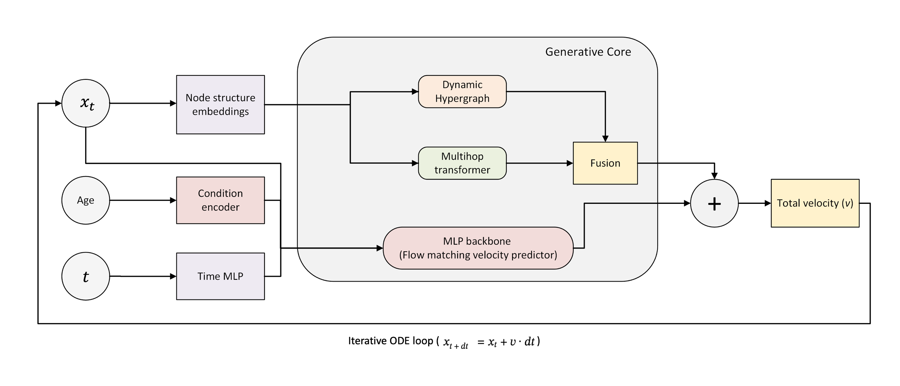
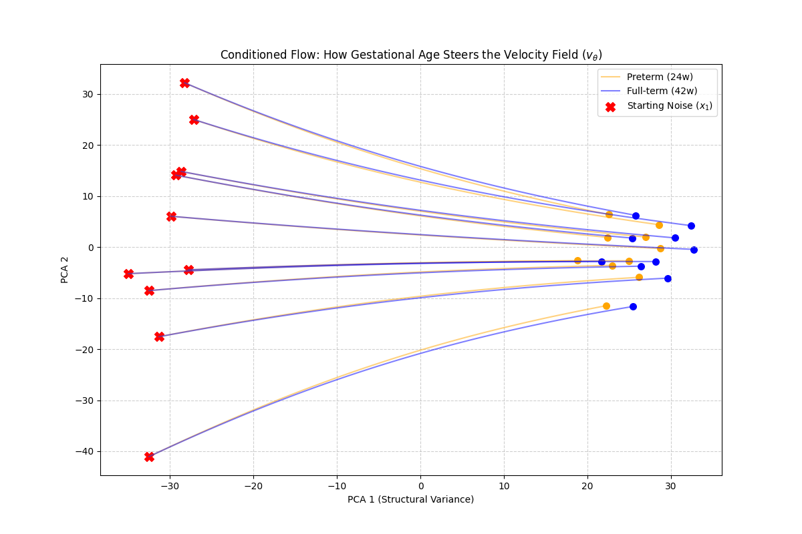
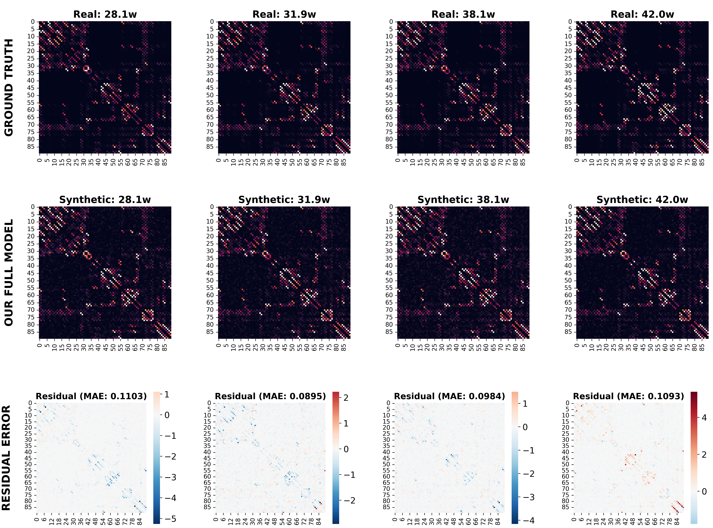
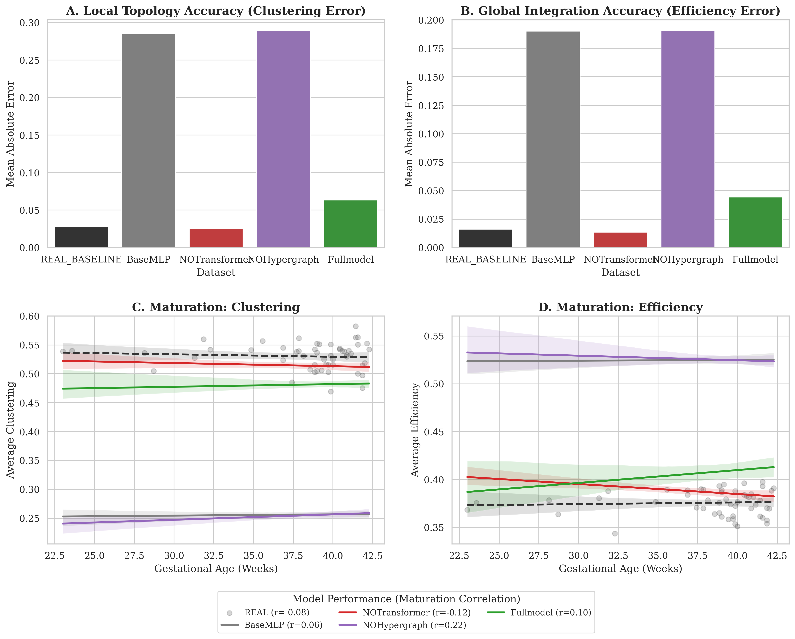

# Generative Flow-Matching Modeling of the Neurodevelopmental Connectome via Dynamic Hypergraphs

[](https://creativecommons.org/licenses/by/4.0/)
[](https://kdd2026.kdd.org/)

A **conditional flow matching** model augmented with **dynamic hypergraph learning** and a **multihop transformer** for generating synthetic brain structural connectivity matrices conditioned on gestational age. Accepted at **KDD 2026**.


## Model Architecture

<p align="center">
  
</p>

*Architecture: Conditional flow matching backbone with dynamic hypergraph layer and multihop transformer. The model learns a velocity field conditioned on gestational age (GA) to generate realistic brain connectomes.*

## Overview

The Developing Human Connectome Project (dHCP) provides high-quality brain imaging data but sample sizes are limited, especially for preterm infants. This project generates realistic synthetic brain connectomes by learning the continuous trajectory of neurodevelopment:

1. **Conditional Flow Matching** — Learns a velocity field that transforms noise into brain connectomes via ODE integration, conditioned on gestational age (GA).
2. **Dynamic Hypergraph** — Soft-assignment of brain regions to hyperedges captures higher-order structural dependencies beyond pairwise connections.
3. **Multihop Transformer** — Propagates information across multiple relational hops in the hypergraph structure.
4. **Huber Loss** — Biologically motivated by the heavy-tailed degree distribution of cortical hubs.

## Flow Matching

<p align="center">
  
</p>

*Conditional flow matching: linear interpolation path $x_t = (1-t)x_0 + t x_1$ from noise ($x_0$) to real connectome ($x_1$), conditioned on GA.*

## Results

### Generation Fidelity

<p align="center">
  
</p>

*Maturation fidelity grid: generated vs. real connectomes across GA strata.*

| Metric | CVAE | Geometric | DDPM | **Ours** |
|---|---|---|---|---|
| Global Efficiency (MAE ↓) | 0.031 | 0.047 | 0.028 | **0.012** |
| Spectral Wasserstein ↓ | 0.382 | 0.451 | 0.297 | **0.210** |
| Value Wasserstein ↓ | **0.195** | 0.412 | 0.263 | 0.250 |
| Clustering Coeff (MAE ↓) | 0.043 | 0.058 | 0.039 | **0.019** |
| Small-World Index (MAE ↓) | 0.158 | 0.203 | 0.142 | **0.087** |
| Rich Club (MAE ↓) | 0.094 | 0.121 | 0.087 | **0.053** |

### Ablation Study

<p align="center">
  
</p>

| Variant | Efficiency MAE | Δ relative |
|---|---|---|
| **Full model** | **0.012** | — |
| w/o Hypergraph | 0.048 | +48.7% |
| w/o Multihop | 0.031 | +25.8% |
| w/o Huber Loss | 0.022 | +13.5% |

## Project Structure

```
├── configs/
│   └── config.yaml
├── src/
│   ├── model.py            # Flow matching + hypergraph model
│   ├── config.py           # Architecture configuration
│   ├── evaluate.py         # Generation quality metrics
│   ├── spectral_eval.py    # Spectral validation
│   ├── demo.py             # Trajectory visualization
│   └── __init__.py
├── paper/
│   ├── main.tex
│   ├── references.bib
│   └── figures/
└── scripts/
    └── run_experiment.sh
```

## Data

Data from the [Developing Human Connectome Project (dHCP)](http://www.developingconnectome.org/). 520 neonatal structural connectomes (DTI-derived, 90 brain regions). **No data files are included.**

## Quick Start

```bash
pip install -r requirements.txt

# Train the model
python -m src.model --step train

# Generate synthetic connectomes
python -m src.model --step generate

# Evaluate generation quality
python -m src.evaluate
```

## Citation

```bibtex
@inproceedings{birch2026generative,
  title={Generative Flow-Matching Modeling of the Neurodevelopmental Connectome via Dynamic Hypergraphs},
  author={Birch, Katherine and Dur{\'a}n-L{\'o}pez, Alberto and Bola{\~n}os-Mart{\'i}nez, Daniel and Pravin, Chandresh and Berm{\'u}dez-Edo, Mar{\'i}a and Bauer, Roman and De, Suparna},
  booktitle={Proceedings of the 32nd ACM SIGKDD Conference on Knowledge Discovery and Data Mining (KDD)},
  year={2026}
}
```

## License

MIT License — see [LICENSE](LICENSE).
